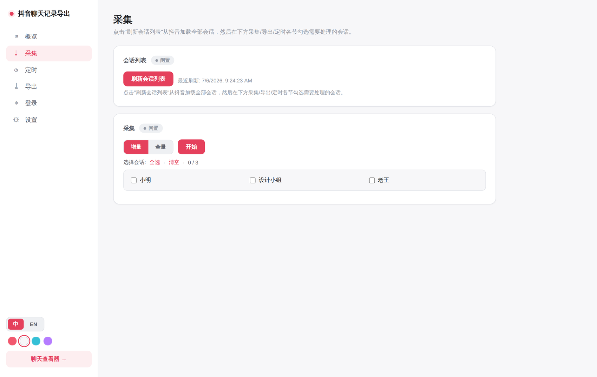

<div align="center">

# 鎶栭煶鑱婂ぉ璁板綍瀵煎嚭宸ュ叿

**浠庢姈闊崇綉椤电増瀹屾暣瀵煎嚭绉佷俊鑱婂ぉ璁板綍锛屾湰鍦?Web 鐣岄潰娴忚銆佹悳绱€佸鍑恒€?*

鐩存帴璋冪敤鎶栭煶 IM 鎺ュ彛锛坧rotobuf锛夋姄鍙栵紝绐佺牬缃戦〉铏氭嫙鍒楄〃鐨勬粴鍔ㄤ笂闄愶紝鍙鍑哄畬鏁村巻鍙层€?

</div>

<div align="center">
  
</div>

> **鐩綍** 路
> [鍔熻兘](#鍔熻兘) 路
> [蹇€熷紑濮媇(#蹇€熷紑濮? 路
> [閮ㄧ讲](#閮ㄧ讲) 路
> [浣跨敤](#浣跨敤) 路
> [鎺у埗闈㈡澘](#鎺у埗闈㈡澘) 路
> [娉ㄦ剰浜嬮」](#娉ㄦ剰浜嬮」)

---

## 鍔熻兘

**閲囬泦**
- **瀹屾暣鍘嗗彶** 鈥?鐩存帴璋冪敤鎶栭煶 IM API锛坧rotobuf锛夛紝绐佺牬铏氭嫙鍒楄〃婊氬姩涓婇檺
- **绮剧‘鎺掑簭** 鈥?鐢ㄦ湇鍔＄ `created_at_us` 鍗曡皟閫掑搴忓彿鎺掑簭锛屾秷鎭『搴忎笉涔?
- **澧為噺鏇存柊** 鈥?澧為噺妯″紡鍙姄鏂版秷鎭?
- **澶氱娑堟伅绫诲瀷** 鈥?鏂囨湰銆佽〃鎯呭寘銆佸浘鐗囥€佽闊炽€佽棰戙€佸垎浜紙瑙嗛/鍟嗗搧/鐩存挱锛夈€佷竴璧风湅瑙嗛銆佸紩鐢ㄥ洖澶嶃€佺郴缁熸秷鎭?

**娴忚**锛圴ue 3 + FastAPI 鍐呯疆鐣岄潰锛?
- 鏃犻檺婊氬姩銆佸叏鏂囨悳绱€佹悳绱㈢粨鏋滀竴閿烦杞埌鍘熸秷鎭?
- 娑堟伅鍒嗙粍銆佸紩鐢ㄥ洖澶嶅尯鍧椼€佸浘鐗囩偣鍑绘斁澶с€佽闊?瑙嗛鍦ㄧ嚎鎾斁
- 5 濂椾富棰樹竴閿垏鎹紙鏆楄壊 / 寰俊缁?/ 娴呰壊 / 鏆栨 / 绱锛夛紝鍏ㄤ腑鏂囩晫闈?

**濯掍綋鏈湴鍖?*
- 鍥剧墖 AES-GCM 瑙ｅ瘑 + HEIC 鑷姩杞?JPEG锛涜闊宠嚜鍔ㄨ惤鍦帮紱瑙嗛 MPEG-CENC 瑙ｅ瘑 + faststart 杞皝瑁?
- 鍙紑鍏炽€屾柊娑堟伅鑷姩涓嬭浇銆嶄笌銆屽洖濉巻鍙插獟浣撱€嶏紝閬垮厤鎶栭煶 CDN 閾炬帴杩囨湡鍚庡け鏁?

**瀵煎嚭 & 杩愮淮**
- 瀵煎嚭 [ChatLab](https://github.com/hellodigua/ChatLab) 鏍囧噯鏍煎紡锛圝SON / JSONL锛夛紝鍙洿鎺ュ仛 AI 鑱婂ぉ鍒嗘瀽
- Web 鎺у埗闈㈡澘锛氬彲瑙嗗寲閲囬泦 / 瀵煎嚭 / 瀹氭椂浠诲姟 / 杩滅▼鎵爜鐧诲綍 / 瀵嗙爜淇濇姢
- 瀹氭椂浠诲姟锛坈ron锛? [Server閰盷(https://sct.ftqq.com) 澶辫触鎺ㄩ€佸埌寰俊
- Docker 涓€閿儴缃诧紝鏁版嵁鎸佷箙鍖栧埌 `./data`

## 蹇€熷紑濮?

宸茶 Docker锛屼笁鏉″懡浠よ窇璧锋潵锛?

```bash
git clone https://github.com/TeamBreakerr/douyin-chat-export.git
cd douyin-chat-export
docker compose up -d --build
```

鐒跺悗 `python3 login.py` 鍦ㄥ涓绘満鎵爜鐧诲綍锛堣[鐧诲綍](#1-鐧诲綍)锛夛紝鍐嶅埌 `/panel` 閲囬泦鍗冲彲銆?
璁块棶 `http://localhost:8001` 娴忚锛宍http://localhost:8001/panel` 鎵撳紑鎺у埗闈㈡澘銆?

## 鐜瑕佹眰

| 渚濊禆 | 鐗堟湰 | 璇存槑 |
|------|------|------|
| Docker | >= 20.10 | **鎺ㄨ崘**锛屽鍣ㄥ唴宸插惈鍏ㄩ儴渚濊禆 |
| Python | >= 3.10 | 鏈湴杩愯鏃剁殑鍚庣涓庨噰闆嗗櫒 |
| Node.js | >= 20.19 鎴?>= 22.12 | 鏈湴杩愯鏃舵瀯寤哄墠绔紙Vite 7 瑕佹眰锛?|

> Docker 鐢ㄦ埛鏃犻渶鎵嬪姩瑁?Python / Node.js锛岀洿鎺ョ湅 [Docker 閮ㄧ讲](#docker-閮ㄧ讲鎺ㄨ崘)銆?

## 閮ㄧ讲

### Docker 閮ㄧ讲锛堟帹鑽愶級

```bash
git clone https://github.com/TeamBreakerr/douyin-chat-export.git
cd douyin-chat-export
docker compose up -d --build
```

宸插寘鍚墠绔瀯寤恒€佸悗绔湇鍔°€丳laywright 娴忚鍣ㄧ幆澧冦€傛暟鎹寔涔呭寲鍦?`./data`銆?

<details>
<summary><b>鐜鍙橀噺</b></summary>

| 鍙橀噺 | 榛樿鍊?| 璇存槑 |
|------|--------|------|
| `MODE` | `all` | `web` 鍙惎鍔?Web / `scraper` 鍙噰闆?/ `all` 鍏ㄩ儴 |
| `HEADLESS` | `true` | 娴忚鍣ㄦ棤澶存ā寮忥紙Docker 涓繀椤讳负 `true`锛?|
| `SCRAPER_INCREMENTAL` | `true` | 閲囬泦鏄惁澧為噺 |
| `SCRAPER_FILTER` | (绌? | 杩囨护鎸囧畾浼氳瘽鍚嶇О |
| `SCRAPER_SCHEDULE` | (绌? | cron 琛ㄨ揪寮忥紝濡?`0 */6 * * *`锛堢┖=涓嶅畾鏃讹級 |

</details>

<details>
<summary><b>鍙嶅悜浠ｇ悊</b></summary>

`docker-compose.yml` 榛樿涓嶆槧灏勭鍙ｏ紝閫氳繃 Docker 缃戠粶 `web-internal` 閰嶅悎鍙嶅悜浠ｇ悊锛堝 Nginx Proxy Manager锛夈€傚闇€鐩存帴璁块棶锛屽姞绔彛鏄犲皠锛?

```yaml
services:
  douyin-chat-export:
    ports:
      - "8001:8001"
```

</details>

### 鏈湴杩愯

```bash
git clone https://github.com/TeamBreakerr/douyin-chat-export.git
cd douyin-chat-export

# Python 鐜
python3 -m venv venv
source venv/bin/activate          # Windows: venv\Scripts\activate
pip install -r requirements.txt
playwright install chromium

# 鏋勫缓鍓嶇锛圢ode.js >= 20.19 鎴?>= 22.12锛?
cd frontend && npm install && npm run build && cd ..

# 鍚姩
python3 -m uvicorn backend.main:app --host 127.0.0.1 --port 8001
```

娴忚 `http://localhost:8001`锛屾帶鍒堕潰鏉?`http://localhost:8001/panel`銆?

<details>
<summary>Node.js 鐗堟湰涓嶅锛?/summary>

Vite 7 瑕佹眰 Node.js **20.19+** 鎴?**22.12+**锛屾帹鑽愮敤 [nvm](https://github.com/nvm-sh/nvm) 绠＄悊锛?

```bash
curl -o- https://raw.githubusercontent.com/nvm-sh/nvm/v0.40.3/install.sh | bash
nvm install 22 && nvm use 22
node -v   # 纭 >= 22.12
```

Windows 鐢ㄦ埛鍙敤 [nvm-windows](https://github.com/coreybutler/nvm-windows) 鎴栦粠 [Node.js 瀹樼綉](https://nodejs.org/) 涓嬭浇 LTS銆?
</details>

## 浣跨敤

### 1. 鐧诲綍

棣栨浣跨敤闇€鐧诲綍鎶栭煶锛屼笁閫変竴锛?

<details open>
<summary><b>鏂瑰紡 A锛氭湰鍦版祻瑙堝櫒鎵爜</b>锛堟帹鑽?Docker 鐢ㄦ埛锛?/summary>

鍦ㄥ涓绘満杩愯锛屽脊鍑虹湡瀹炴祻瑙堝櫒绐楀彛鎵爜锛岀櫥褰曟€佺粡 volume 鑷姩鍚屾鍒板鍣細

```bash
# 闇€鍏堣 Playwright锛歱ip install playwright && playwright install chromium
python3 login.py
```

鎵爜鎴愬姛鍚庢祻瑙堝櫒鑷姩鍏抽棴锛涙娴嬪埌瀹瑰櫒浼氳嚜鍔ㄩ噸鍚娇鐧诲綍鐢熸晥銆?
</details>

<details>
<summary><b>鏂瑰紡 B锛欳ookie 瀵煎叆</b>锛堟棤娉曞湪瀹夸富鏈鸿 Playwright 鏃讹級</summary>

鍦ㄤ换鎰忔祻瑙堝櫒鐧诲綍鎶栭煶鍚庡鍑?Cookie锛?

1. 鎵撳紑 `douyin.com` 骞剁櫥褰?
2. `F12` 鈫?**Application** 鈫?**Cookies** 鈫?`https://www.douyin.com`
3. 鍙抽敭 Cookie 琛ㄦ牸绌虹櫧澶?鈫?**Copy all cookies**
4. 鎺у埗闈㈡澘 `/panel` 鈫?**鐧诲綍** 鈫?**瀵煎叆 Cookie**锛岀矘璐村鍏?

鏀寔 JSON 鏁扮粍锛圖evTools Copy all cookies锛夊拰 `key=value; key=value` 瀛楃涓诧紙`document.cookie`锛変袱绉嶆牸寮忋€?
</details>

<details>
<summary><b>鏂瑰紡 C锛氭帶鍒堕潰鏉胯繙绋嬫壂鐮?/b></summary>

`/panel` 鈫?**鐧诲綍** 鈫?**鎵爜鐧诲綍**锛岄€氳繃鎴浘杩滅▼鎿嶄綔瀹瑰櫒鍐呮祻瑙堝櫒銆傞€傚悎涓存椂浣跨敤锛屽欢杩熻緝楂樸€?
</details>

鐧诲綍鎬佷繚瀛樺湪 `data/browser_profile/`锛岀粡 volume 鎸佷箙鍖栥€?

### 2. 閲囬泦

鍦ㄦ帶鍒堕潰鏉?**閲囬泦** 鍒嗗尯鍙鍖栨搷浣滐紙澧為噺/鍏ㄩ噺鍒囨崲銆佸嬀閫変細璇濄€佸疄鏃舵棩蹇楋級锛屾垨鐢ㄥ懡浠よ锛?

```bash
python3 extract.py                          # 鍏ㄩ噺閲囬泦鎵€鏈変細璇?
python3 extract.py --filter "浼氳瘽鍚嶇О"        # 鍙噰闆嗘寚瀹氫細璇?
python3 extract.py --filter "浼氳瘽鍚嶇О" --incremental   # 澧為噺锛堝彧鍙栨柊娑堟伅锛?
```

### 3. 瀵煎嚭涓?ChatLab 鏍煎紡

瀵煎嚭 [ChatLab](https://github.com/hellodigua/ChatLab) 鏍囧噯鏍煎紡锛屽彲鐩存帴瀵煎叆鍋?AI 鍒嗘瀽锛?

```bash
python3 export.py --filter "浼氳瘽鍚嶇О"                    # JSONL锛堥粯璁わ級
python3 export.py --filter "浼氳瘽鍚嶇О" --format json      # JSON
python3 export.py --filter "浼氳瘽鍚嶇О" --output data/export.jsonl
```

瀵煎嚭鍐呭锛氭枃鏈€佽〃鎯呫€佸浘鐗?URL銆佽闊筹紙base64 宓屽叆锛夈€佸垎浜摼鎺ャ€佸紩鐢?鍥炲鍏崇郴銆備篃鍙湪鎺у埗闈㈡澘 **瀵煎嚭** 鍒嗗尯涓€閿搷浣溿€?

## 鎺у埗闈㈡澘

璁块棶 `/panel`锛屼晶鏍忓垎鍖虹鐞嗗叏閮ㄥ姛鑳斤細

<div align="center">
  
</div>

| 鍒嗗尯 | 鍔熻兘 |
|------|------|
| **姒傝** | 浼氳瘽鏁?/ 娑堟伅鏁?/ 鐢ㄦ埛鏁?|
| **閲囬泦** | 鍒锋柊浼氳瘽鍒楄〃銆佸閲?鍏ㄩ噺鍒囨崲銆佸嬀閫変細璇濄€佸疄鏃舵棩蹇?|
| **瀹氭椂** | 鏍囧噯 cron 琛ㄨ揪寮?+ 棰勮蹇嵎鎸夐挳 |
| **瀵煎嚭** | 閫夋牸寮忓拰浼氳瘽涓€閿鍑轰笅杞姐€佸獟浣撳洖濉紙鍘嗗彶鍥剧墖/瑙嗛锛?|
| **鐧诲綍** | 杩滅▼鎵爜銆丆ookie 瀵煎叆銆佹鏌?娓呴櫎鐧诲綍鎬?|
| **璁剧疆** | 璁块棶瀵嗙爜銆丼erver閰?澶辫触閫氱煡锛? 濂椾富棰樸€佷腑鑻辨枃鍒囨崲 |

<details>
<summary><b>閰嶇疆澶辫触閫氱煡锛圫erver閰憋級</b></summary>

閫傚悎寮€浜嗗畾鏃朵换鍔＄殑鐢ㄦ埛锛歝ookie 澶辨晥銆佹姈闊虫帴鍙ｅ彉鍔ㄥ鑷撮噰闆嗗け璐ユ椂涓诲姩鎺ㄩ€侊紝鍏嶅幓瀹氭椂鏌ラ潰鏉裤€?

1. 鍒?[sct.ftqq.com](https://sct.ftqq.com) 鐢ㄥ井淇＄櫥褰曪紝澶嶅埗 SendKey锛堝舰濡?`SCT...`锛?
2. 鎺у埗闈㈡澘 鈫?**璁剧疆** 鈫?閫氱煡 鈫?绮樿创 SendKey 鈫?**璁剧疆**
3. 鐐?**娴嬭瘯** 楠岃瘉寰俊鑳芥敹鍒?

鍚庣画姣忔閲囬泦澶辫触锛堝惈瀹氭椂浠诲姟锛夎嚜鍔ㄦ帹閫侊細

```
鎶栭煶鑱婂ぉ瀵煎嚭 路 閲囬泦澶辫触
澶辫触鏃堕棿: 2026-05-26 18:42:11
鍘熷洜: 閲囬泦澶辫触 (exit code 2)
鏃ュ織鏈熬:
  [+] 娴忚鍣ㄥ凡鍚姩
  [*] 绛夊緟鎵爜鐧诲綍...
  [-] 鏈兘鐧诲綍锛岄€€鍑?
```

</details>

## 娉ㄦ剰浜嬮」

- 鏈伐鍏蜂粎鐢ㄤ簬瀵煎嚭**鑷繁鐨?*鑱婂ぉ璁板綍澶囦唤锛岃鍕跨敤浜庨潪娉曠敤閫?
- 鎶栭煶鍙兘闅忔椂鏇存敼鎺ュ彛瀵艰嚧宸ュ叿澶辨晥
- 濯掍綋 CDN URL 鏈夌鍚嶆湁鏁堟湡锛堢害 1 骞达級锛岃繃鏈熷悗鏈湰鍦板寲鐨勫浘鐗?琛ㄦ儏灏嗘棤娉曟樉绀?
- 璇煶鏂囦欢鑷姩涓嬭浇鍒?`data/media/voice/`锛屼笉鍙?CDN 杩囨湡褰卞搷
- 鎺у埗闈㈡澘鍙紑鍚€屽浘鐗囨湰鍦颁笅杞姐€嶏紝灏嗗浘鐗囧拰琛ㄦ儏鍖呮寔涔呭寲鍒?`data/media/`

## License

MIT

